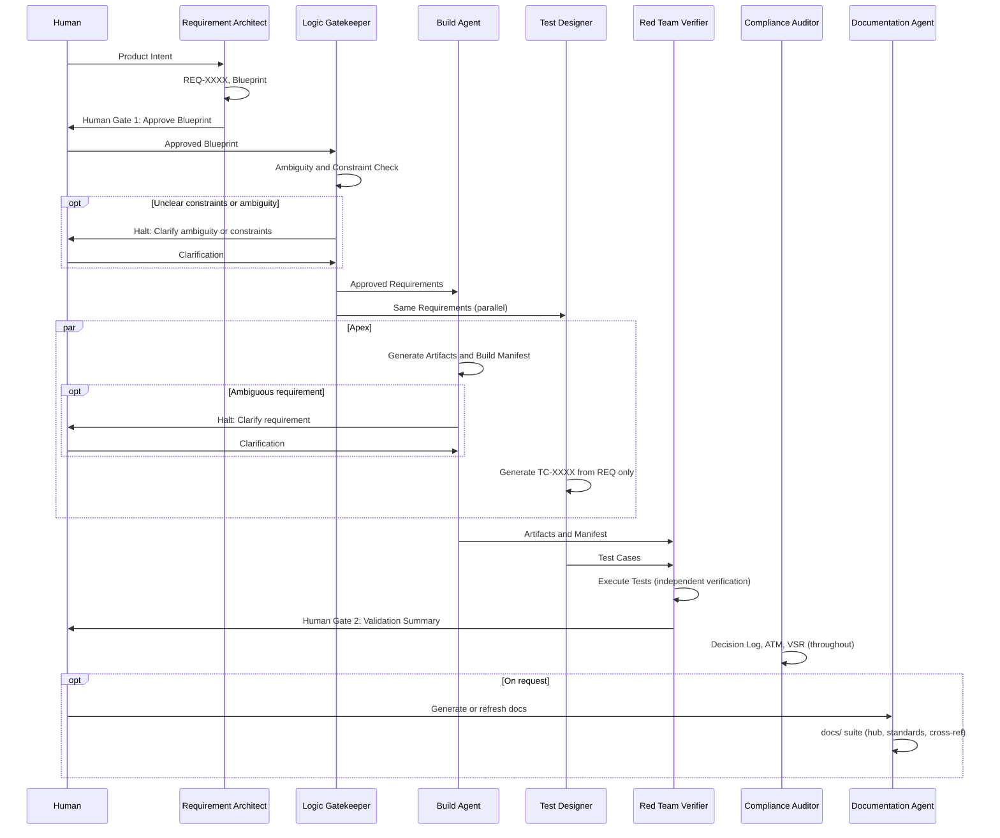

# Agile V™ Agent Skills Library

### *Verifiable AI-Augmented Engineering*

[](https://agile-v.org/)
[](https://agentskills.io/specification)
[](https://creativecommons.org/licenses/by-sa/4.0/)

This repository contains the official collection of **Agent Skills** for the Agile V™ framework. These skills are designed to transform standard LLMs into specialized engineering agents capable of building, verifying, and auditing complex systems with mathematical rigor.

## The Vision: From Manifesto to Execution

The [Agile V™ Manifesto](https://agile-v.org) provides the philosophy; this repository provides the **mechanics**. 

By deploying these skills, you move away from "unstructured prompting" and toward a formal **Autonomous Quality Management System (AQMS)**. Every skill in this library is built to enforce:

- **Traceability:** Every action is linked to a Requirement ID.
- **Verification:** No artifact is created without a "Red Team" challenge.
- **Human Curation:** Automated stops at critical "Human Gates."

## 🛠 Repository Structure

The skills are organized following the **Agile V™ Infinity Loop**. Each skill lives at the root level (or under `domains/` for language-specific extensions) for ease of use. You can reference skills directly with simple paths like `./agile-v-core/SKILL.md` when configuring Cursor or other agent tools.

```text
├── agile-v-core/           # Foundation: Core philosophy and operational logic
├── requirement-architect/  # Left Side: Intent and decomposition
├── logic-gatekeeper/       # Left Side: Ambiguity and constraint validation
├── build-agent/            # Apex: Core build agent (language-agnostic)
├── test-designer/          # Apex: Verification suite design
├── schematic-generator/    # Apex: Schematics, netlists, HDL
├── domains/                # Apex: Language-specific build agent extensions
│   ├── build-agent-dart/
│   ├── build-agent-embedded/
│   ├── build-agent-js/
│   ├── build-agent-nestjs/
│   └── build-agent-python/
├── red-team-verifier/      # Right Side: Verification and Red Teaming
├── compliance-auditor/     # Compliance: Audit and governance
└── documentation-agent/    # Documentation: Standards-based repo docs (ISO 9001, V-Model, ISO 27001)
```

## 📦 Included Skills


| Skill                 | Category   | Path                            | Purpose                                                                                                                                                                                                    |
| --------------------- | ---------- | ------------------------------- | ---------------------------------------------------------------------------------------------------------------------------------------------------------------------------------------------------------- |
| agile-v-core          | Foundation | `agile-v-core/`                 | The baseline "operating system" for all agents. Includes context engineering, orchestration pipeline, state persistence, and model tier guidance.                                                          |
| requirement-architect | Left Side  | `requirement-architect/`        | Converts intent into atomic, traceable requirements.                                                                                                                                                       |
| logic-gatekeeper      | Left Side  | `logic-gatekeeper/`             | Validates requirements for ambiguity and physical/hardware constraints.                                                                                                                                    |
| build-agent           | Apex       | `build-agent/`                  | Generates code, firmware, HDL from approved requirements (language-agnostic). Includes context engineering, pre-execution validation, and post-verification feedback loop.                                 |
| test-designer         | Apex       | `test-designer/`                | Designs verification suite from requirements only—runs parallel to Build Agent.                                                                                                                            |
| schematic-generator   | Apex       | `schematic-generator/`          | Generates schematics, netlists, HDL for hardware/PCB projects.                                                                                                                                             |
| build-agent-python    | Apex       | `domains/build-agent-python/`   | **Comprehensive Python build agent** for backends (FastAPI/Flask/Django), data pipelines, ML, and scripts. Includes architecture patterns, testing strategy, security guidance, and SCOPE-V integration.   |
| build-agent-js        | Apex       | `domains/build-agent-js/`       | **Comprehensive JavaScript/TypeScript build agent** for React/Next.js frontends and Node.js backends. Includes state management, security patterns, testing strategy, and build tools.                      |
| build-agent-dart      | Apex       | `domains/build-agent-dart/`     | **Comprehensive Dart/Flutter build agent** for mobile apps. Includes BLoC/Provider state management, platform channels, widget patterns, and testing strategy.                                              |
| build-agent-embedded  | Apex       | `domains/build-agent-embedded/` | **Comprehensive embedded C/C++ build agent** for safety-critical systems. Includes MISRA-C, RTOS patterns, hardware abstraction, security, and certification support (ISO 26262, IEC 61508).                 |
| build-agent-nestjs    | Apex       | `domains/build-agent-nestjs/`   | **Comprehensive NestJS build agent** for enterprise backends. Includes dependency injection, TypeORM/Prisma, GraphQL, microservices, and testing patterns.                                                  |
| red-team-verifier     | Right Side | `red-team-verifier/`            | Challenges build artifacts; produces Validation Summary for Human Gate 2. Includes stub/anti-pattern detection and post-verification feedback protocol.                                                    |
| compliance-auditor    | Compliance | `compliance-auditor/`           | Automates decision logging, traceability matrix (ATM), and VSR for ISO/GxP.                                                                                                                                |
| documentation-agent   | Compliance | `documentation-agent/`          | Generates standards-based repo documentation (ISO 9001, V-Model, ISO 27001, optional GAMP 5) into `docs/` with hub README, cross-reference matrix, Mermaid diagrams, and compliance posture documentation. |


## Compliance Documentation

The repository includes a full compliance posture assessment under `[docs/compliance/](docs/compliance/)`. This documentation was generated from a clause-by-clause audit of the v1.3 skills against ISO 9001:2015, ISO 13485:2016, AS9100D, ISO 27001:2022, and GxP/GAMP 5.


| Document                                                                | Purpose                                                       |
| ----------------------------------------------------------------------- | ------------------------------------------------------------- |
| [Compliance Posture Overview](docs/compliance/01_COMPLIANCE_POSTURE.md) | What the skills cover, what they don't, and the honest scope  |
| [ISO 9001 Matrix](docs/compliance/02_ISO_9001_MATRIX.md)                | Clause-by-clause status for quality management                |
| [ISO 13485 Matrix](docs/compliance/03_ISO_13485_MATRIX.md)              | Clause-by-clause status for medical devices                   |
| [AS9100D Matrix](docs/compliance/04_AS9100D_MATRIX.md)                  | Clause-by-clause status for aerospace                         |
| [ISO 27001 Matrix](docs/compliance/05_ISO_27001_MATRIX.md)              | Control-by-control status for information security            |
| [GxP / GAMP 5 Matrix](docs/compliance/06_GXP_GAMP5_MATRIX.md)           | Requirement-by-requirement status for pharma/life sciences    |
| [Gap Roadmap](docs/compliance/07_GAP_ROADMAP.md)                        | Prioritized action plan with 18 gaps, owners, and Gantt chart |


> [!NOTE]
> The skills claim `"ISO 9001 / ISO 27001 Aligned (Design Phase); GxP-Aware"`. This is an honest scope -- the skills cover design and development controls, not production, manufacturing, or full organizational QMS. The compliance documentation tells you exactly what you get and what you still need to do for your regulatory context.

## Skill Interaction Flow




### Requirements artifact (source of truth)

The Requirement Architect exports the approved Blueprint (after Human Gate 1) to a **requirements file** (default: `REQUIREMENTS.md` in the project root). The Logic Gatekeeper then **reads** that file, validates it (ambiguity, constraints, conflicts), and **writes back** any user-approved adjustments to the same file. All downstream agents (Build Agent, Test Designer, Red Team Verifier, Schematic Generator, Compliance Auditor) **read requirements from this file**, not from in-chat handoff. Using a single persisted file as the requirements source reduces context-window pressure, avoids carrying the full Blueprint in conversation, and lets parallel or sequential agent runs (e.g. build per feature) reference the same canonical artifact.

### Documentation artifact (documentation-agent)

The Documentation Agent writes all output into the project's `**docs/`** directory (created if missing). The hub `**docs/README.md**` provides the document map, quick navigation and per-standard tables, cross-reference matrix (concerns × standards), repository structure reference, and applicable standards table. One subdirectory per selected standard, e.g. `**iso9001/**`, `**iso27001/**`, `**v-model/**` by default; (optionally `**gamp5/**` or other standards when the user requests it) contains numbered markdown documents for that standard. Every generated document (except the hub) includes a header (Document ID, Version, Date, Classification, Status), navigation (Back to Documentation Hub, Previous/Next when applicable), and a footer with a Document History table; any diagrams are Mermaid only, embedded in markdown. The default standards are ISO 9001, V-Model (lifecycle), and ISO 27001; additional standards (e.g. GAMP 5) are included only when the user specifies them.

### Context Engineering and Orchestration (v1.2)

Version 1.2 introduces **context engineering**, **orchestration pipeline**, **state persistence**, and **post-verification feedback** patterns adapted from [Get Shit Done (GSD)](https://github.com/gsd-build/get-shit-done) by Lex Christopherson ([MIT License](https://github.com/gsd-build/get-shit-done/blob/main/LICENSE)). These additions address how agents manage context windows, coordinate handoffs, persist project state across sessions, and iterate after verification failures.

**Key additions:**

- **Context Engineering** (`agile-v-core`, `build-agent`, all domain agents): Rules for managing context window quality -- thin orchestrator pattern, fresh context per task, task sizing to 50% of context, passing file paths instead of contents.
- **Orchestration Pipeline** (`agile-v-core`): Defines pipeline stages, handoff rules, wave-based parallel execution with dependency analysis, and checkpoint types (auto, human-verify, human-decision, human-action).
- **State Persistence** (`agile-v-core`): Standard `.agile-v/` project directory structure for persisting requirements, build manifests, decision logs, traceability matrices, and session state across sessions.
- **Pre-Execution Validation** (`build-agent`): 5-dimension check before synthesis -- requirement coverage, artifact completeness, dependency order, scope sanity, and interface contracts.
- **Post-Verification Feedback Loop** (`build-agent`, `red-team-verifier`): Auto-fix rules, severity classification (CRITICAL/MAJOR/MINOR), 3-attempt limit per failure, and re-verification protocol with append-only records.
- **Stub and Anti-Pattern Detection** (`red-team-verifier`): 11-item detection checklist for placeholder returns, TODO markers, empty handlers, hardcoded secrets, and more.
- **Model Tier Guidance** (`agile-v-core`): Recommended model capability tiers per agent role (High for architecture decisions, Medium for code generation, Low for structured logging).

### Iteration Lifecycle and Document Versioning (v1.3)

Version 1.3 introduces the **multi-cycle V-loop** -- the ability to run second and subsequent iterations while preserving full traceability, versioned documents, and audit evidence from prior cycles.

**Key additions:**

- **Iteration Lifecycle** (`agile-v-core`): Defines Cycle IDs (`C1`, `C2`, ...), cycle triggers, re-entry points, document versioning scheme, and cycle archival to `.agile-v/cycles/CN/`. Requirements carry per-REQ status tags (`approved`, `modified`, `new`, `deprecated`, `superseded`) with cycle references.
- **Change Request Protocol** (`agile-v-core`, `requirement-architect`): `CR-XXXX` records in `.agile-v/CHANGE_LOG.md` that formally track every requirement modification between cycles with rationale, impact analysis, and Human Gate approval.
- **Multi-Cycle Re-Validation** (`logic-gatekeeper`): Scoped re-validation -- only `new` and `modified` requirements go through full validation; unchanged requirements are skipped unless constraints shifted.
- **Artifact Versioning** (`build-agent`): `ART-XXXX.N` revision scheme -- unchanged artifacts carry forward without rebuild; modified artifacts get a revision bump with CR reference.
- **Regression and Delta Testing** (`test-designer`): Test cases classified as `delta` (new/modified REQs) or `regression` (unchanged REQs). Regression baseline carried forward from prior cycle. Retired tests preserved for traceability.
- **Cycle-Aware Verification** (`red-team-verifier`): Delta and regression results reported separately. Unexpected regression failures (no related CR) are automatically **CRITICAL**.
- **Cycle-Aware ATM** (`compliance-auditor`): Traceability matrix partitioned by cycle. CR end-to-end chain validation. Cycle boundary audit checklist. VSR extended with Cycle History table.

### Runtime governance contracts (v1.4)

Version 1.4 adds **Phase 1-2** adoption from the competitive analysis: machine-readable **trace** (`TRACE_LOG.md`), **eval flywheel** (`EVAL_RESULTS.md` + Human Gate 2 **EvalGate** block in `VALIDATION_SUMMARY.md`), **policy-as-code** (`POLICY.yaml` + templates), **failure taxonomy** (`FT-*` codes on every `VER-*` record), and **durable Human Gate checkpoints** (`CHECKPOINTS.md` with `resume_token` linked to `APPROVALS.md`). Normative schema: [`docs/agile-v-runtime/01_SCHEMAS.md`](docs/agile-v-runtime/01_SCHEMAS.md); copy templates from [`templates/agile-v/`](templates/agile-v/).

### Release baseline (v1.6)

Version 1.6 consolidates runtime governance adoption by shipping the repository-level runtime schema spec + templates and aligning core routing/docs for Eval Gate evidence and durable HITL workflow. See [v1.6 release notes](V1.6_RELEASE_NOTES.md).

### Compliance Hardening (v1.3)

Version 1.3 also includes compliance hardening based on a clause-by-clause audit against ISO 9001:2015, ISO 13485:2016, AS9100D, ISO 27001:2022, and GxP/GAMP 5. The compliance metadata has been updated from `"ISO/GxP-Ready"` to `"ISO 9001 / ISO 27001 Aligned (Design Phase); GxP-Aware"` to accurately reflect the scope.

**Key additions:**

- **Risk Management** (`agile-v-core`): `RISK_REGISTER.md` with severity matrix, risk categories (technical, process, compliance, security), and assessment rules per pipeline stage. Addresses ISO 9001 6.1, AS9100D 8.1.1.
- **CAPA Protocol** (`agile-v-core`): `CAPA_LOG.md` with root cause analysis (5-Whys), corrective action, preventive action, and effectiveness verification. Addresses ISO 13485 8.5, ISO 9001 10.1/10.2.
- **Human Gate Approval Records** (`agile-v-core`): `APPROVALS.md` with approver identity, role/authority, signature method, and evidence reference. Minimum requirements by regulatory context (non-regulated through ISO 13485). Addresses 21 CFR Part 11, Annex 11.
- **AI Agent Security Controls** (`agile-v-core`): LLM provider documentation in `config.json` (data residency, retention, training usage, confidentiality certification), data classification rules, agent access controls, and file integrity verification. Addresses ISO 27001 A.5.23, A.8.3.
- **Periodic Review and Revalidation** (`agile-v-core`): `REVALIDATION_LOG.md` with defined triggers (model change, runtime change, skill change, accumulated CRs, 12-month interval). Model version tracking in `config.json`. Addresses GxP/GAMP 5 periodic review.
- **Quality Metrics and KPIs** (`compliance-auditor`): 7 defined metrics (first-pass verification rate, defect density, requirement coverage, regression pass rate, CR cycle time, open CAPA count, traceability completeness) with trend analysis. Addresses ISO 9001 9.1, AS9100D 9.1.1.
- **Secure Coding** (`build-agent`): 7 minimum secure coding rules (input validation, error handling, no hardcoded secrets, parameterized queries, bounded operations, least privilege, dependency awareness). Addresses ISO 27001 A.8.28.
- **Nonconformity Disposition** (`red-team-verifier`): Formal disposition categories (rework, accept-as-is, reject, defer) with CAPA trigger criteria. Addresses ISO 9001 8.7, ISO 13485 8.3.

### Context Optimization (v1.3)

All 8 core skill files have been rewritten for minimal context window consumption. Total reduction: **1,670 → 670 lines (60%)**, with zero information loss.


| Skill                 | Before              | After             | Reduction |
| --------------------- | ------------------- | ----------------- | --------- |
| agile-v-core          | 610 lines / 33 KB   | 227 lines / 12 KB | 63%       |
| build-agent           | 151 lines / 9.6 KB  | 74 lines / 3.8 KB | 51%       |
| red-team-verifier     | 212 lines / 10.5 KB | 89 lines / 4.2 KB | 58%       |
| compliance-auditor    | 186 lines / 8.4 KB  | 77 lines / 3.3 KB | 59%       |
| requirement-architect | 119 lines           | 50 lines          | 58%       |
| logic-gatekeeper      | 71 lines            | 38 lines          | 46%       |
| test-designer         | 124 lines           | 53 lines          | 57%       |
| documentation-agent   | 197 lines           | 62 lines          | 69%       |


**Techniques used:**

- `**sections_index` in YAML frontmatter** -- agents jump to the section they need without scanning the full document.
- **Directive tables** replace prose paragraphs -- 6 core directives fit in one table instead of 6 subsections.
- **Inline notation** (`;` and `·` separators, numbered items on single lines) replaces verbose multi-line bullets.
- **Format templates show structure only** -- one example is sufficient; agents know how to repeat a pattern.
- **Cross-references** replace duplication -- "see agile-v-core" instead of re-explaining shared concepts.

**Impact on agent execution:**

- `agile-v-core` consumes ~~12 KB (~~3% of a 200K context window) instead of 33 KB (~8%).
- A typical workflow loads core + one role skill: ~16 KB total vs ~43 KB before.
- The `sections_index` enables immediate section lookup, reducing scanning overhead.

> [!IMPORTANT]
> **Maintain Rigorous Test Independence:**  
> When running the workflow within a **single chat** or environment, **always execute the Test Designer *before* launching the Build Agent**. This ensures the Test Designer derives its test suite solely from the requirements and not from any artifacts, code, or outputs generated by the Build Agent.  
> By preserving this strict order, you safeguard the impartiality of the verification process and prevent accidental cross-contamination, thereby maximizing the integrity and trustworthiness of your independent test coverage.

> [!TIP]
> **Scaling the build phase:** With a large number of features or requirements, consider running the build agent **per feature or per small subset** (sequentially) to improve focus and quality. Running **multiple build-agent instances in parallel** can speed things up but may introduce race conditions (e.g. concurrent edits to the same files); use with care and plan your merge or review strategy accordingly. See the **Wave-Based Parallel Execution** section in `agile-v-core` for dependency-aware parallelism guidance.

## How to Use

Below are practical ways to use these skills in common editors and agents.

### Using Agile V™ skills in your editor or agent

- **Cursor**  
Skills are discovered from `.cursor/skills/` (project) or `~/.cursor/skills/` (global). Each skill is a folder containing a `SKILL.md` file with YAML frontmatter. The agent auto-applies relevant skills; you can also invoke a skill manually by typing `/` in Agent chat and searching for the skill name. Clone this repo and copy the skill folders you need (e.g. `agile-v-core/`, `requirement-architect/`, `domains/build-agent-python/`) into `.cursor/skills/`.
For more information on how to use Skills in Cursor please refer to the [official documentation](https://cursor.com/docs/context/skills).
- **Claude Code**  
Skills are discovered from `.claude/skills/` (project) or `~/.claude/skills/` (global). Each skill is a folder containing a `SKILL.md` file with YAML frontmatter. The agent auto-applies relevant skills; you can also invoke a skill manually by typing `/` in Agent chat and searching for the skill name. Clone this repo and copy the skill folders you need (e.g. `agile-v-core/`, `requirement-architect/`, `domains/build-agent-python/`) into `.cursor/skills/`.
For more information on how to use Skills in Cursor please refer to the [official documentation](https://code.claude.com/docs/en/skills).
- **VS Code**  
VS Code supports two types of skills. Project skills, stored in your repository like `.github/skills/`, `.claude/skills`, `.agents/skills/` or personal skills stored globally like `~/.copilot/skills/`, `~/.claude/skills`, `~/.agents/skills/`.
The agent auto-applies relevant skills; you can also invoke a skill manually by typing `/` in Agent chat and searching for the skill name. Clone this repo and copy the skill folders you need (e.g. `agile-v-core/`, `requirement-architect/`, `domains/build-agent-python/`) into one of the directories mentioned above.
For more information on how to use Skills in VS Code please refer to the [official documentation](https://code.visualstudio.com/docs/copilot/customization/agent-skills).
- **GitHub Copilot**  
Github Copilot supports two types of skills. Project skills, stored in your repository like `.github/skills/`, `.claude/skills` or personal skills stored globally like `~/.copilot/skills/`, `~/.claude/skills`.
The agent auto-applies relevant skills; you can also invoke a skill manually by typing `/` in Agent chat and searching for the skill name. Clone this repo and copy the skill folders you need (e.g. `agile-v-core/`, `requirement-architect/`, `domains/build-agent-python/`) into one of the directories mentioned above.
For more information on how to use Skills with Github Copilot please refer to the [official documentation](https://docs.github.com/en/copilot/concepts/agents/about-agent-skills).
- **Other tools (Claude Agent SDK, Windsurf, Continue, Cody, Zed, etc.)**  
For other tools please refer to the official documentation of your desired tool.

To learn more about skills and how to use skills in general, please follow the [instructions and documentation](https://agentskills.io/integrate-skills) of Agent Skills.

## 🏢 Enterprise & Team Integration: Standardizing Excellence

Agile V™ is built to function as the quality layer between your team’s expertise and any AI agent they use. Whether teams rely on proprietary LLMs, local models, or different IDEs, the **engineering standard remains consistent** across the organization.
Thanks to Agent Skills every agent behaves according to the same engineering principles, no matter where or how it runs.

### 🧩 Encoding Company Knowledge into "Agent DNA"

Organizations can extend the public Agile V™ skills (e.g., `agile-v-core`) with private **Company Skills** that embed institutional knowledge directly into agent behavior.

- **Internal Compliance:** Wrap Agile V™ skills with company-specific safety protocols, regulatory checklists, or GxP requirements so every agent interaction is compliant by default.
- **Legacy Wisdom:** Capture “lessons learned” from past projects in a **Gatekeeper Skill** that prevents agents from repeating known failure modes or architectural mistakes.
- **Tool Agnostic Logic:** Because Agile V™ focuses on *Logic Gates* and *Traceability*, it works whether your team uses GitHub Copilot, Cursor, custom LangChain flows, or manual prompting.

Your standards live in the skills, not in the tool.

### 🛡️ Quality as a Constant

Agile V™ establishes a minimum quality floor across all teams and agents.

1. **Uniform Audits:** Every developer, regardless of experience level, uses agents that follow the same **Red Team Protocol** and quality checks.
2. **Decoupled Intelligence:** When switching from one AI model to another, your **Agile V™ Skills** preserve engineering constraints, review gates, and your Definition of Done.
3. **Institutional Memory:** With Principle #9 (Decision Logging), the reasoning behind engineering choices is stored in the repository, not in individual developers’ heads, ensuring long-term maintainability.

> [!TIP] 
> Teams can maintain a private `/internal-skills` directory that inherits from the root-level skills (e.g., `agile-v-core/`). This enables a **“Global Standard, Local Context”** workflow; shared principles with company-specific adaptations.

## Versioning

- **Repository:** The repo uses [semantic versioning](https://semver.org/) driven by [Conventional Commits](https://www.conventionalcommits.org/). On each push to `main`, a GitHub Action reads the commit message and bumps the version accordingly: `feat:` → minor, `fix:` (and `chore:`, `docs:`, etc.) → patch, `BREAKING CHANGE` or `type!:` → major. It then creates a new git tag (e.g. `v1.5.1`) and updates the root `[package.json](package.json)`. The version field and tag are maintained by the workflow; do not edit `package.json` version by hand for releases. The same file holds repo metadata (name, description, author, repository, license).
- **Skills:** Each skill is versioned independently via `metadata.version` in its `SKILL.md` frontmatter ([agentskills.io](https://agentskills.io/specification) style). Skills are not version-locked to each other; bump a skill’s version only when that skill’s content or contract changes.

## 🤝 Contributing New Skills

We welcome contributions! To add a new skill to the Agile V™ ecosystem, it must adhere to the following rules:

1. **Strict Traceability:** The skill must include procedures for logging the "Why" behind every output.
2. **Verification Step:** If the skill generates an artifact, it must include a sub-process for checking that artifact against its parent requirement.
3. **No Hallucination:** The skill must be instructed to "Halt and Ask" when requirements are ambiguous.
4. **Format:** Must include a SKILL.md with valid YAML frontmatter as per the [agentskills.io spec](https://agentskills.io/specification).
5. **License:** The skill must be licensed under **CC-BY-SA-4.0** (Creative Commons Attribution-ShareAlike 4.0). Include `license: CC-BY-SA-4.0` in the frontmatter.
6. **Metadata:** The skill must include `metadata.author` (e.g., `agile-v.org`) and `metadata.version` (e.g., `"1.0"`). Each skill has its own version; maintainers bump it when that skill changes.

> [!NOTE]
> **Contribution guidelines in progress:** We are currently developing comprehensive contribution guidelines for the community. The rules above are the current minimum requirements. A full spec, including review process, quality checklist, and community standards, will be published soon. Watch this space or check [agile-v.org](https://agile-v.org) for updates.

## 📜 License

The Agile V™ Agent Skills Library is published under the **[Creative Commons Attribution-ShareAlike 4.0 International (CC BY-SA 4.0)](https://creativecommons.org/licenses/by-sa/4.0/legalcode.en)** license.